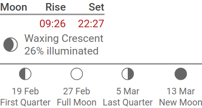

# moondata

A PHP script to output HTML giving the current phase of the moon along with the dates of upcoming phases. This block of code is meant to be used as an include template for a Wview weather site.

See my [blog post](https://blog.webguy.pw/blog/adding-a-moon-data-widget-to-wview-website/) for a full description of how to use this.

## Set Up

1. Edit the time zone, latitude, and longitude values for your location.
2. Set up cron to run this script periodically, such as:

```
# Calculate current moon phase
0 */2 * * * /usr/local/bin/moondata > /usr/local/etc/wview/html/moon.incx
```

## Sample Output

With CSS and SVG icons (included), it displays as (the moon rise and set time actually comes from the Wview template):



## Credits

This script uses the PHP Class [php-moon-phase](https://github.com/solarissmoke/php-moon-phase) by Samir Shah for all of the actual calculations.

